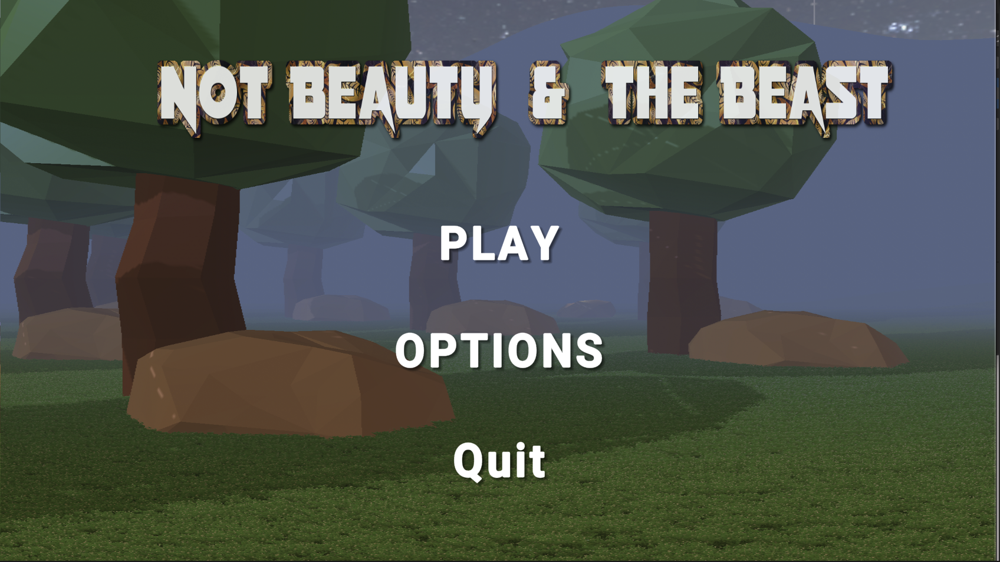
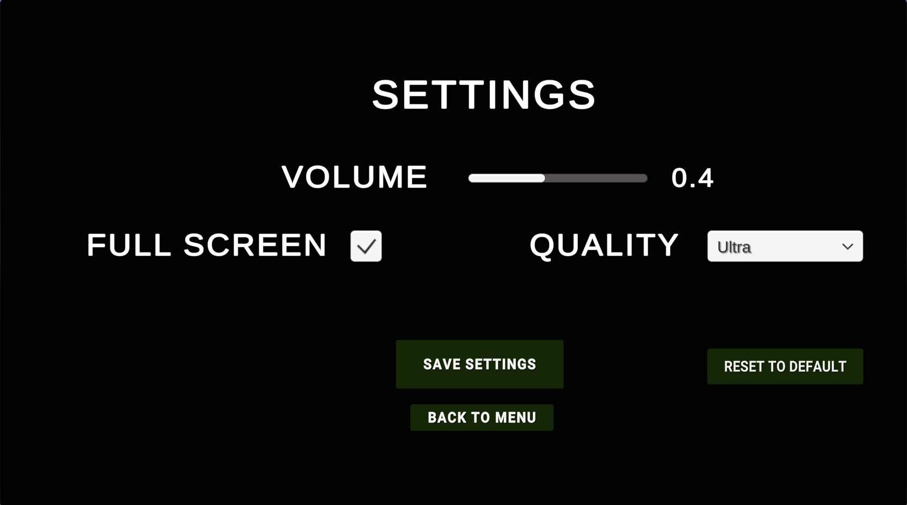
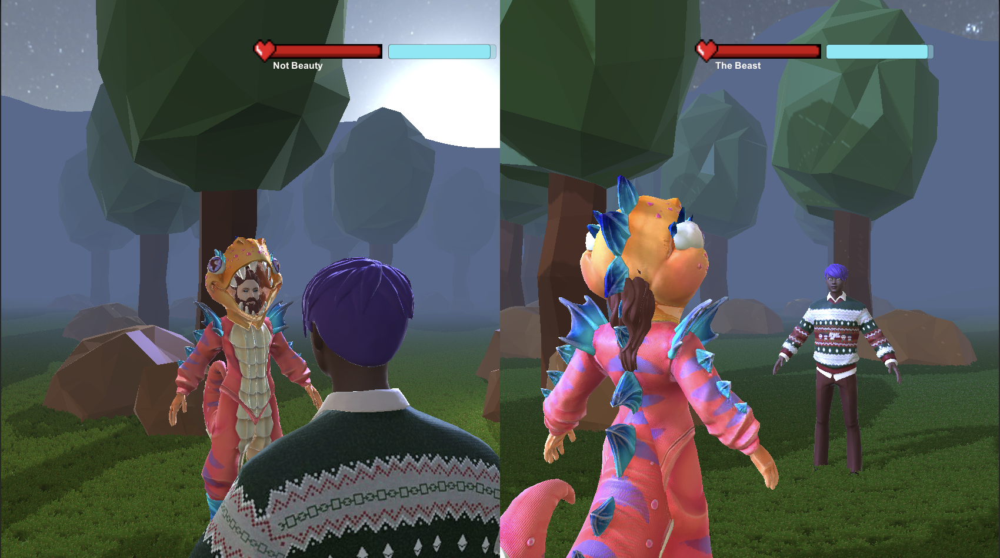

# Not Beauty and the Beast
## Multiplayer Fighting Game by **Greek Salad Tiger Milk** (Elyess Eleuch, Liav Keren, Sophie Preußer, Linh Pham)
Unity project for B23.1 GT2 Game Engines WiSe21/22.

# Features

## Menu and Settings

Game starts in separate Menu scene. Click on **PLAY** loads the Game scene.

Click on **Options** opens Settings Menu which allows users to choose and save their preferred settings.

## The Game

Two players can play against each other.

Features include

- **Split Screen** 
  - Screen is split in half so both players can play from their own perspective.
- **Health Bar**
  - Empties with every punch. When the Health Bar is empty the player loses the Game.
- **Stamina Bar**
  - The Stamina bar empties when the player moves. If it's empty the player can not act and has to wait for it to re-fill.
- **Input System**
- **Sound Effects**
  - You can get in the mood when Rocky's Theme Music starts playing on the main menu. While playing, the soft breeze of wind is surrounding you and is only disturbed by the sounds of pain and effort when the players move and hit.
- **Stunning Visuals**

## Game Play

The player moves using the keyboard 
- **W** The player moves away from the camera
- **S** The player turns and moves in the direction of the camera
- **A** The player turns and moves left
- **D** The player turns and moves right
- **SPACE** The player jumps
- **ESC** The Exit Prompt appears and asks the player if they would like to return to the menu or keep playing.

The Player can **punch with clicking the mouse**. If they hit the enemy the value of the enemy's health bar decreases.

#### Internal Things
- Please make sure to import Animations under Assets before starting the project
- No direct pushes to master, If you built a new feature then please checkout a new branch and then make a merge request
- Merge Requests has to be reviewed/tested by at least one person, if it was approved then it can be merged (please no hard feelings here and dob't anything personal :))
- Private fields has to start with an underscore please ("_")
- Please try to name your variables as accurate as possible (think of the people who don't know the code)
- Please try to stay within the convention of conventional commits https://www.conventionalcommits.org/en/v1.0.0/

